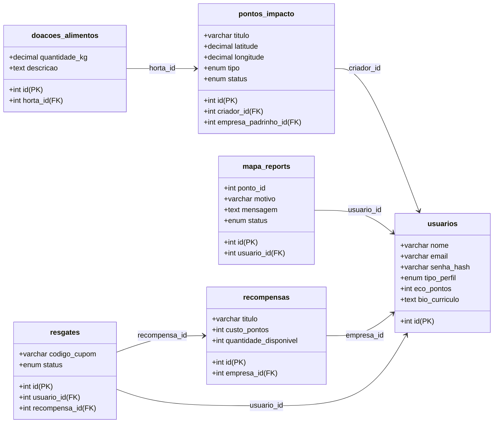

# 🌿 EcoConecta
## Sustentabilidade Comunitária e Economia Circular em São Paulo
### Solução Integradora para a Regeneração Urbana e Combate à Fome

---

## 👥 Equipe de Desenvolvimento
*   **Barbara Silva** — Idealizadora & Desenvolvedora
*   **Thamires Martins** — Coordenadora de Projetos
*   **Jefferson Borges** — Desenvolvedor Backend
*   **Richard Greghi** — Especialista em UX/UI
*   **Ricardo Pighin** — Desenvolvedor Frontend
*   **Matheus Araujo** — Analista de Banco de Dados

---

## 🎯 1. O Conceito e a Oportunidade
O **EcoConecta** surge para mitigar três grandes desafios urbanos de São Paulo: descarte inadequado de resíduos, subutilização de espaços públicos degradados e vulnerabilidade alimentar.

### A Oportunidade:
*   **Reciclagem Produtiva:** Conectar cidadãos que descartam resíduos a artesãos de upcycling, transformando descarte em valor econômico.
*   **Restauração Urbana:** Mapear áreas degradadas e mobilizar mutirões comunitários para a criação de hortas urbanas produtivas.
*   **Combate à Fome:** Utilizar o cultivo das hortas comunitárias para doar alimentos frescos a projetos sociais de refeições solidárias.

---

## 🏗️ 2. Arquitetura e Stack Tecnológica
*   **Frontend Responsivo (UI/UX):** Interface com **HTML5 & CSS3 Customizado**, utilizando *CSS Grid*, *Flexbox*, efeitos *glassmorphism* e micro-animações interativas.
*   **Backend Híbrido & Seguro:** PHP 8.x com controle de sessões, **Autenticação via Google (Google Sign-In)** e processador transacional nativo.
*   **Banco de Dados Relacional:** MySQL otimizado para portabilidade de servidores (usando laços associativos compatíveis e evitando `fetch_all`) e restrições `ON DELETE CASCADE`.
*   **Analytics Comportamental:** Rastreamento com **Microsoft Clarity** para otimização de fluxos.

---

## 📊 3. Checklist de Módulos e Conformidade

| Módulo do Sistema | Descrição / Objetivo | Status | Componente Principal |
| :--- | :--- | :---: | :--- |
| **Mapa de Impacto** | Geolocalização de hortas, ecopontos e lojas | **100% OK** | `mapa.php` + Leaflet/API |
| **Marketplace P2P** | Venda de upcycling, doações e sementes | **100% OK** | `marketplace.php` |
| **Guia & Quizzes** | Educação verde com premiação de EcoPontos | **100% OK** | `guia.php` + `usuario_quizzes` |
| **EcoLoja** | Resgate de vouchers cadastrados por empresas | **100% OK** | `ecoloja.php` + `resgates` |
| **Green CV** | Perfil/Currículo consolidado do voluntário | **100% OK** | `perfil.php` + `exporta_curriculo.php` |
| **Painel de Impacto** | Dashboard estatístico de KG de alimentos e resgates | **100% OK** | `dashboard.php` |
| **Conformidade LGPD** | Termos, política de dados e exclusão segura | **100% OK** | `privacidade.php` + `lgpd_exclusao.php` |

---

## 🗺️ 4. Mapa de Impacto & Relatórios de Status
### Tela: Mapeamento de Pontos (`mapa.php` / `processa_report.php`)
*   **Geolocalização Interativa:** Exibição dinâmica de pontos ecológicos (ecopontos, hortas comunitárias, zonas de troca) em São Paulo.
*   **Relatório de Ocorrências (Reports):** O cidadão atua como fiscal da cidade, enviando alertas sobre o status de conservação dos pontos (ex: relatar ponto degradado ou horta que necessita de irrigação).
*   **Apadrinhamento Corporativo:** Conexão direta que permite a empresas apadrinharem financeiramente canteiros e hortas de bairro.

---

## 🎁 5. EcoLoja & Sistema de Recompensas
### Tela: Loja de Benefícios Ecológicos (`ecoloja.php` / `processa_resgate.php`)
*   **Gamificação Ambiental:** O cidadão converte suas ações sustentáveis (como a conclusão de quizzes educativos) em EcoPontos.
*   **Troca por Vouchers Reais:** Os pontos acumulados são trocados na EcoLoja por benefícios oferecidos por empresas sustentáveis (ex: adubo orgânico de minhoca, sacolas ecológicas de algodão, descontos em orgânicos).
*   **Segurança de Resgate:** Geração automática de código de cupom único (`ECO-XXXXXX-VOLT`) com validação transacional que impede resgates duplicados sem saldo.

---

## 📚 6. Educação Verde & Quizzes Interativos
### Tela: Hub de Aprendizado e Testes (`guia.php` / `processa_quiz.php`)
*   **Guias de Capacitação:** Leitura estruturada sobre Compostagem Doméstica, Reciclagem Correta, Economia Circular e Hortas Urbanas.
*   **Testes de Múltipla Escolha:** Sistema de quizzes dinâmicos integrados a cada guia.
*   **Recompensas Inteligentes:** A base de dados registra a conclusão do quiz por usuário na tabela `usuario_quizzes` para evitar trapaça ou bonificação múltipla, creditando os EcoPontos na carteira do usuário.

---

## 🍅 7. Hortas Comunitárias & Combate à Fome
### Tela: Gestão de Safras e Doações (`processa_doacao_alimento.php`)
*   **Monitoramento de Colheitas:** Cadastro simplificado do peso total em quilogramas (Kg) colhido de hortas parceiras.
*   **Distribuição de Alimentos:** Vinculação de doações direcionadas a cozinhas solidárias, sopões comunitários e paróquias do município.
*   **Dados Reais no Seed:** Mais de **500 kg** de hortaliças, temperos e tubérculos cadastrados no banco de dados como prova de conceito.

---

## 💼 8. Green CV & Oportunidades Verdes
### Tela: Perfil de Impacto e Carreira (`perfil.php` / `oportunidades.php`)
*   **Digital Green CV:** Perfil do cidadão que funciona como um portfólio de impacto socioambiental, exibindo insígnias, total de EcoPontos, mutirões concluídos e formação teórica.
*   **Exportação em Lote:** Módulo integrado para geração de currículo formatado para impressão ou envio.
*   **Portal de Vagas Verdes:** Quadro de oportunidades focado em estágios ESG, consultoria de crédito de carbono, técnico em gestão de resíduos e oficinas profissionalizantes.

---

## 🔒 9. Resiliência, Segurança & LGPD
### Diretrizes: Segurança da Informação e Privacidade (`lgpd_exclusao.php`)
*   **Google Auth & LGPD:** Cadastro em clique único vinculando o aceite transparente das políticas de dados.
*   **Ocultação de Dados Sensíveis:** Proteção contra vazamento de credenciais locais/produção usando arquivos de template (`.example.php`) ignorados no Git.
*   **Criptografia Bcrypt & Exclusão:** Hashes irreversíveis de senha e exclusão total física/lógica da conta a pedido do cidadão (direito ao esquecimento).

---

## 🗂️ 10. Diagrama de Entidade-Relacionamento (DER)

---

## 📈 11. Conclusão e Diferenciais do EcoConecta
O **EcoConecta** prova que a tecnologia web pode atuar como um elo viável de inovação social, gerando benefícios duradouros para cidades e cidadãos.

### Principais Diferenciais:
1.  **Modelo de Negócio Sustentável:** Plataforma ganha-ganha ligando cidadãos (gamificação), pequenos produtores (visibilidade/marketplace) e empresas sustentáveis (ESG/branding).
2.  **Design Premium CSS:** Interface limpa, intuitiva, com excelente paleta de cores e alta legibilidade.
3.  **Engajamento Comunitário Real:** Foco em ações locais georreferenciadas na cidade de São Paulo.
4.  **Robusto e Seguro:** Banco de dados seguro com restrições CASCADE e adequação total à LGPD.
